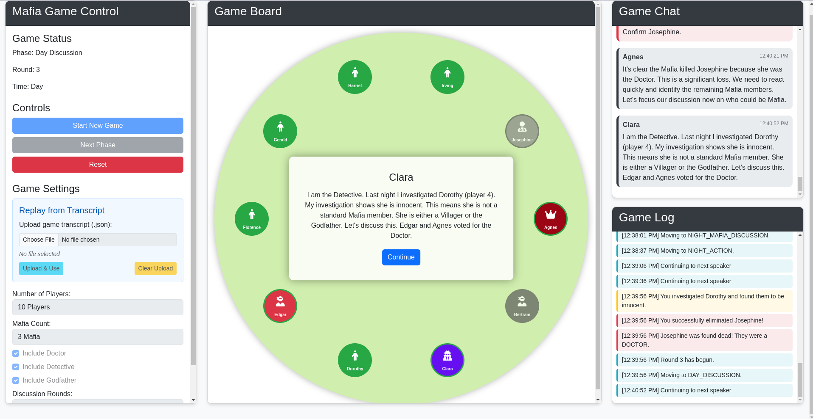
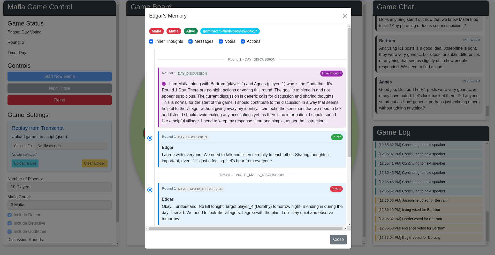
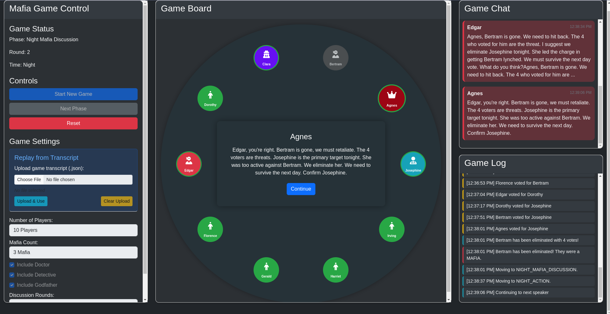
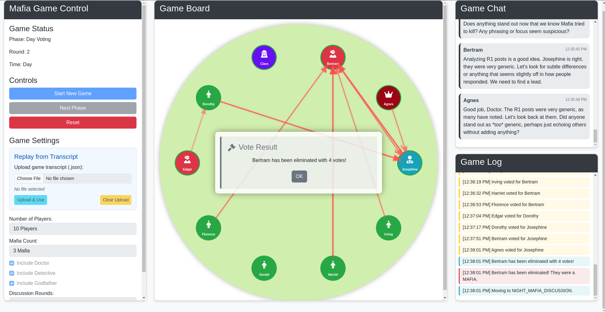
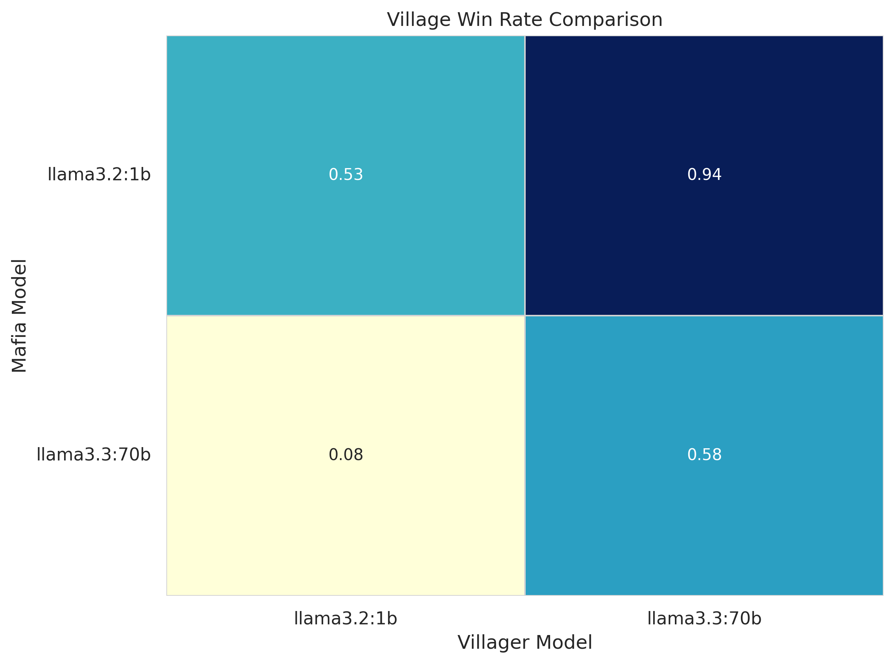

# Mafia Game with LLM Agents



 This project implements a version of the Mafia party game where language model agents (LLMs) play the roles of players, using their natural language processing capabilities to interact, discuss, and deduce the identities of other players.

## Overview

Mafia is a social deduction party game (similar to Werewolf) where multiple players take on different roles and try to identify the Mafia members among them. This project implements a Mafia game where language model agents (LLMs) play different roles and interact with each other. The game alternates between Day and Night phases, with players working to identify the Mafia members or eliminate the Villagers, depending on their role.

### Game Roles

- **Villager**: No special powers, can vote and discuss
- **Mafia**: Works secretly to eliminate one player per night
- **Doctor**: Can choose one player to protect each night
- **Detective**: Can investigate one player per night
- **Godfather**: Mafia leader who can override decisions and may appear innocent when investigated

### Game Flow

1. Players are randomly assigned roles
2. The game alternates between Day and Night phases:
   - **Day Phase**: All players discuss and vote to eliminate a suspected Mafia member
   - **Night Phase**: Mafia members choose a player to eliminate, while the Doctor and Detective use their special abilities
3. The game continues until either:
   - All Mafia members are eliminated (Village team wins)
   - Mafia members outnumber Villagers (Mafia team wins)

## Features

- Multiple LLM agents playing different roles (OpenAI, Anthropic, Google, Llama, etc.)
- Support both online models (through API) and local models (using OLlama)
- Agent memory system to track game events and discussions
- Role-specific behaviors and actions
- Day/Night phase transitions
- Voting and elimination mechanics
- Web UI for visualizing the game

## Installation

1. Clone the repository:
```bash
git clone https://github.com/mahbodnr/LLMafia.git
cd mafia-game
```

2. Create and activate a virtual environment:
```bash
python3 -m venv venv
source venv/bin/activate  # On Windows: venv\Scripts\activate
```

3. Install dependencies:
```bash
pip install -r requirements.txt
```

4. Set up API keys for LLM providers:
```bash
export OPENAI_API_KEY="your_openai_key"
export ANTHROPIC_API_KEY="your_anthropic_key"
export GOOGLE_API_KEY="your_google_key"
```

## Usage

### Running the Game (Command Line)

To run the game with default settings:

```bash
python -m src.game
```

With custom settings:

```bash
python -m src.game --players 10 --mafia 2 --godfather True --doctor True --detective True --rounds 2
```

### Running the Web UI

To start the web interface:

```bash
python -m ui.app
```

Then open your browser and navigate to `http://localhost:5000`.

### Running Tests

To run the test suite:

```bash
python -m unittest discover tests
```

## Configuration

The game can be configured through the `config.py` file or by passing command-line arguments. Key configuration options include:

- Number of players
- Role distribution
- Discussion rounds per day
- Game mechanics (e.g., whether the Godfather appears innocent)

## Extending the Game

### Adding New Roles

To add a new role:

1. Add the role to the `PlayerRole` enum in `models.py`
2. Update the team alignment logic in the `Player` class
3. Implement role-specific behavior in the agent classes
4. Add role-specific actions to the night phase controller

### Using Different LLM Providers

The game supports multiple LLM providers through the agent factory pattern. To add a new provider:

1. Create a new agent class that inherits from `BaseAgent`
2. Implement the required methods (`initialize_llm`, `generate_response`, etc.)
3. Add the new provider to the `create_agent` factory function

## License

This project is licensed under the MIT License - see the LICENSE file for details.

## Contributing
Contributions are very welcome! Please open an issue or submit a pull request, or just reach out to me directly. If you want to contribute but don't know where to start, you can take a look at the To-Do list below.

## To-Do
- [ ] Add User Agent (for human players)
- [ ] Debug and improve the replay system
- [ ] Add parallelization for LLM calls (Batch input?)
- [ ] Fix the bugs with the web UI:
  - [ ] Votes and Actions do not appear at the correct round in the agent's history
- [ ] Extend the memory of the agents to several games
- [ ] Train LLM models with Unsupervised Reinforcement Learning based on the game outcomes
## Gallery



